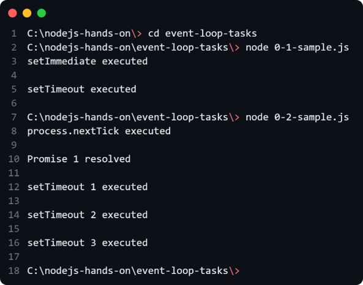

# Node.js Hands-on

## 🚀 Get Started

#### Step 1: Pre-requisites

Download and install the following software:

- Node.js on [Ubuntu](https://www.digitalocean.com/community/tutorials/how-to-install-node-js-on-ubuntu-22-04)/[Windows](https://nodejs.org/dist/v20.17.0/)
  - Preferred to install Node Version Manager (NVM) for [Ubuntu](https://tecadmin.net/how-to-install-nvm-on-ubuntu-22-04/)/[Windows](https://github.com/coreybutler/nvm-windows/releases).
  - Open a terminal and then type `nvm install 20.17.0` to install Node.js v20.17.0
  - Then type `nvm use 20.17.0` to use the Node.js v20.17.0 to install node packages
- Code editor
  - Visual Studio Code (VSCode) ([official Link](https://code.visualstudio.com/Download))
  - IntelliJ Ultimate [Ubuntu](https://www.golinuxcloud.com/install-maven-ubuntu/)/[Windows](https://www.jetbrains.com/de-de/idea/download/#section=windows)
- Git on [Ubuntu](https://www.digitalocean.com/community/tutorials/how-to-install-git-on-ubuntu-22-04#installing-git-with-default-packages)/ [Windows](https://git-scm.com/downloads)
- Github Desktop on [Ubuntu](https://www.linuxcapable.com/how-to-install-github-desktop-on-ubuntu-linux/)/[Windows](https://desktop.github.com/)

#### Step 2: Clone the repository

- If you have GitHub Desktop installed
  - Clone the repository by clicking the green `Code` button and then `Open with GitHub Desktop`.
  - Select the location where you want to clone the repository and click the `Clone` button.
- Open a terminal and type the command below to clone the repository.
  ```bash
  git clone https://github.com/shoebjoarder/nodejs-hands-on
  ```

#### Step 3: Switch branch

- Open the project using a code editor.
- In VSCode, click `Terminal` menu from the top menu and click `New Terminal`.

- Switch between branches to view the different topics. Type `git checkout <branch_name>` in the terminal to switch between the branches. Remember to replace `<branch_name>` with the actual branch name, e.g.,
  ```bash
  git checkout 1-nodejs-hands-on-template
  ```

#### Step 4: Run the JS files
- In the terminal, Type the following command `node <directory-name>` to move to a directory. Replace `<directory-name>` with an actual name of the directory, e.g.,
  ```bash
  cd event-loop-tasks
  ```
- Type the following command `node <file-name>` to run a JS file. Replace `<file-name>` with an actual name of the file, e.g.,
  ```bash
  node 0-1-sample.js
  ```

<p align="center">
    
</p>
